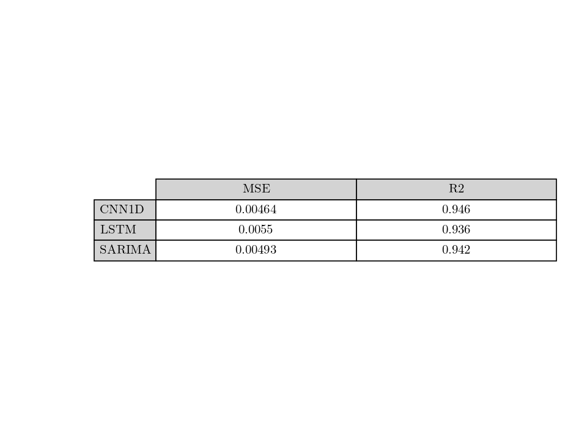
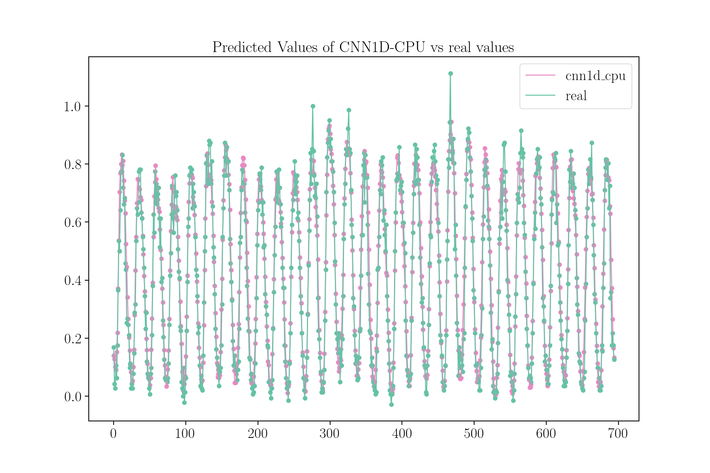
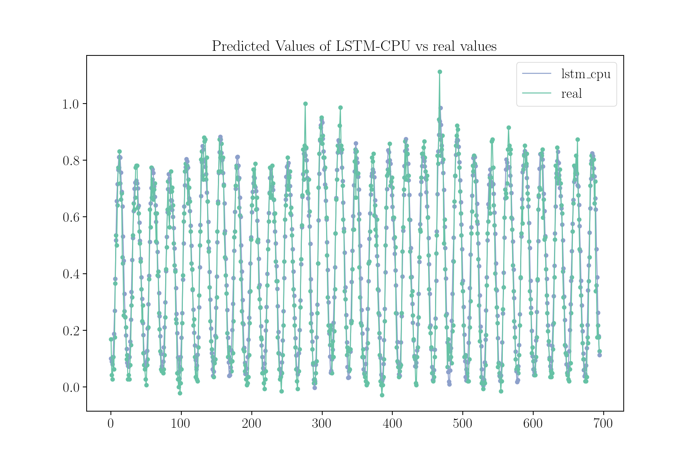
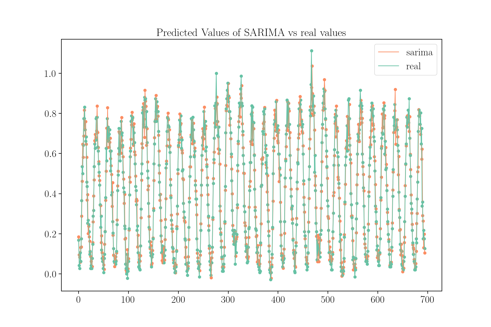
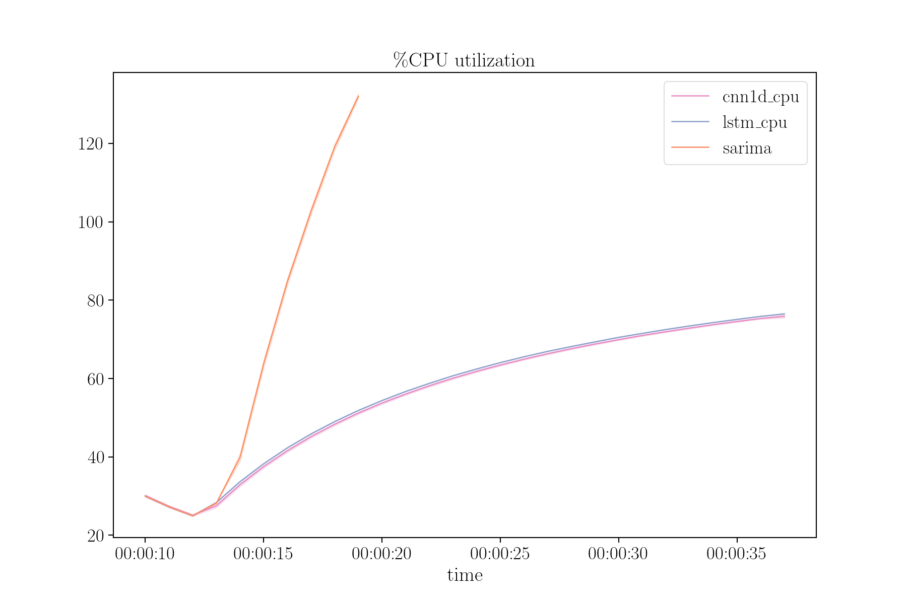
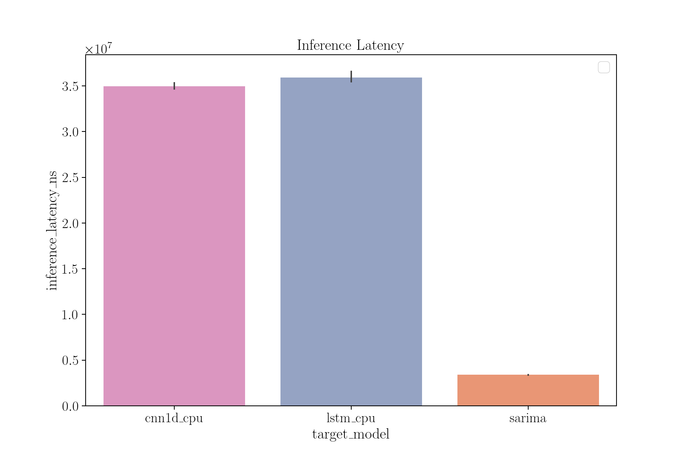
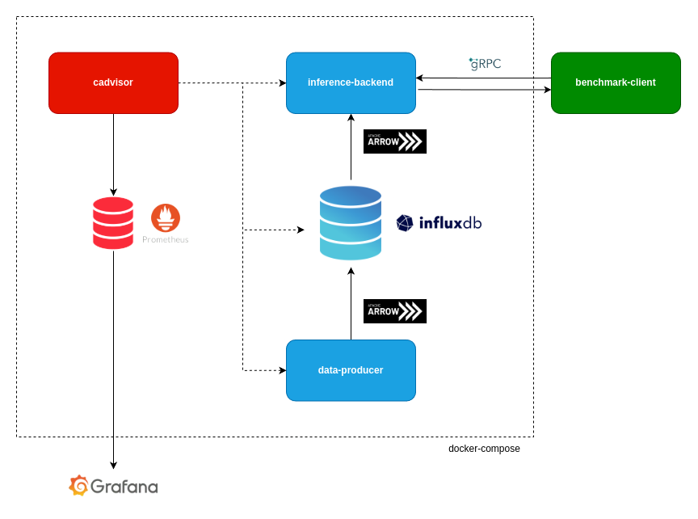

# Network-Digital-Twin
This repository contains the code for a benchmark about the network traffic prediction capabilities of different traffic prediction models.
Even though an accuracy evaluation of the two models is also provided, this is not the main purpose of this benchmark, which instead aims at comparing the resource utilization of th two different solutions in order to drive the development of context aware NDTs capable of self-configuring themselves to adapt to different application scenarios (e.g. depending on the availability of system resources the DT autonomously decides to perform the inference on the CPU or on the GPU).
Within the repo a PoC implementation of a containerized NDT is also provided.

## Repo Organization
The repository is organized in three main folders, `inference-benchmark`, which contains the dataset and the notebooks used to train the ML models and perform the actual benchmark, and `network-digital-twin`, containing a PoC implementation of a container-based network digital twin leveraging the produced forecasting models.

```bash
network-digital-twin
|
|-- inference-benchmark
|   |
|   |-- models                   # trained models
|   |   |
|   |   |-- lstm.keras
|   |   |-- sarima.pkl
|   |   |-- scaler.pkl
|   |
|   |-- raw-dataset
|   |   |
|   |   |-- sms-call-internet-mi-2013-11-01.txt
|   |   |-- ...
|   |   |-- sms-call-internet-mi-2013-11-01.txt
|   |   |-- sms-call-internet-mi-2013-11.zip
|   |
|   |-- data-cleaning.ipynb      # noteboook to clean the raw-dataset
|   |-- requests.csv             # output of data-cleaning.ipynb, number of requests per hour (entire db)
|   |-- model-training.ipynb     # notebook to train the models 
|   |-- test-dataset.csv         # output of model-training.ipynb, test section of model-training
|   |-- train-dataset.csv        # output of model-training.ipynb, test section of model-training    
|   |-- latency-benchmark.py     # script to measure latency and accuracy
|   |-- latency-benchmark.csv    # output of latency-benchmark.py 
|   |-- resource-benchmark.sh    # script to measure cpu and memory
|   |-- resource-benchmark.csv   # output of resource-benchmark.ipynb
|   |-- benchmark-analysis.ipynb # notebook to compare the models and plot the result
|
|-- network-digital-twin
    |
    |-- benchmark-client/...    
    |-- data-producer-mock/...
    |-- inference-backend/...
    |-- influx-db/...
    |-- docker-compose.yaml

```

## Data Cleaning and Model Training
The models have been trained on the [Telecom Italia Dataset](https://doi.org/10.7910/DVN/EGZHFV), particularly on the connection data captured by the Duomo radio-antenna (id=5060) from 01/11/2013 to 31/12/2013.
The dataset presents one record for each UE connecting to the antenna, grouped in slots of ten minutes.
If a UE is still connected to the antenna at the beginning of the following time-slot another record is added.
Each record has the following schema:
```bash
+--------------+------------+-------------+--------------+---------------+------------------+
|      Cell ID |  SMS Input |  SMS Output | Call Data In | Call Data Out | Internet Traffic |
+--------------+------------+-------------+--------------+---------------+------------------+
``` 
Using the `data-cleaning.ipynb` notebook, the data has been reshaped in order to have one record for each hour of the day containing the total number connected UEs, the resulting dataset has the following schema:
```bash
+--------------+-----------------+
|     DateTime |  Total Requests |
+--------------+-----------------+
``` 
The resulting dataset has been used to train three models:
- a SARIMA(1,0,1)(1,0,1) model with a seasonality period of length 7*24 (one week of observations), implemented with the `statsmodel` library
- an LSTM with a window size of length 24 (one day of observation), implemented with `keras`.
- an CNN1D with an input size of length 24 (one day of observation), implemented with `keras`

## Inference Benchmark
The benchmark consisted in the collection of a series metrics from the operation the two models.
In particular, by running the `latency-benchmark.py` script with different configurations, each model was used to perform around 200 predictions of a single value, measuring latency, as well as MSE and R2 Score.
The average percentage of CPU and memory usage in a second were also measured during the inference process using the `ps` Linux utility every 0.1 seconds.
All the tests were performed on an Ubuntu Server 24.04.3 LTS vm with a quad-core CPU.
The actual code used for the benchmark can be found in the `latency-benchmark.py` and `resource-benchmark.sh` respectively.

### Results
#### Accuracy






#### Resource Utilization




## Network Digital Twin PoC

